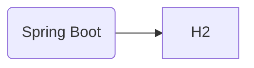

# 쇼핑몰 서비스

## 프로젝트 개요

이 프로젝트는 Spring Boot를 사용하여 간단한 Rest API 를 구현했습니다. 사용자는 상품을 검색하고 주문할 수 있고 관리자는 상품과 주문을 관리할 수 있습니다.

### 기술 스택

* Spring Boot 3
* Java 17
* H2 in-memory DB
* Gradle

### 아키텍처

### 시나리오

* 쇼핑몰을 방문하면 제품을 볼 수 있어요
* 주문하려면 회원가입을 해야 해요
* 여러 상품을 같이 주문할 수 있어요. 하나의 주문(Order)에 들어간 각 제품들은 OrderItem으로 구분해요
* 재고가 없으면 주문할 수 없어요

 
 

## 기능

#### 사용자 인증 (Spring Security 사용)
로그인, 권한 관리 기능을 제공해요

#### JWT
웹 브라우저와 모바일에서 동시에 사용할 수 있어요. 추후 클라우드에서 서비스하게 될 것을 생각해서 세션 대신 선택했어요. 
access 토큰은 1시간, refresh 토큰은 24시간 유효해요

#### 헬스체크 (Spring Actuator 사용)
1시간마다 정기적으로 확인해서 문제가 생기면 메시지를 전송해요

#### Validation (Spring Validation 사용)
전송받는 값의 오류를 줄여 리소스를 낭비하지 않기 위해 사용했어요

  
 
 

## API 명세
https://localhost:8080/swagger-ui/index.html

## 테스트 방법
(image)

## 트러블 슈팅
* 관리자만 상품을 등록, 삭제할 수 있어야 하는데 일반 사용자도 가능하던 문제
-> 설정 순서가 틀렸음을 알게 되어 수정하고 테스트 코드 작성

* 주문을 조회하면 해당 주문건에 포함된 상품들이 빈 리스트로 나타나던 문제

## 개선 사항
* 프론트 페이지
* 상품 설명은 보통 여러 이미지로 구성됨
* 소셜 로그인 기능
* 결제 기능
* 도메인 구입
