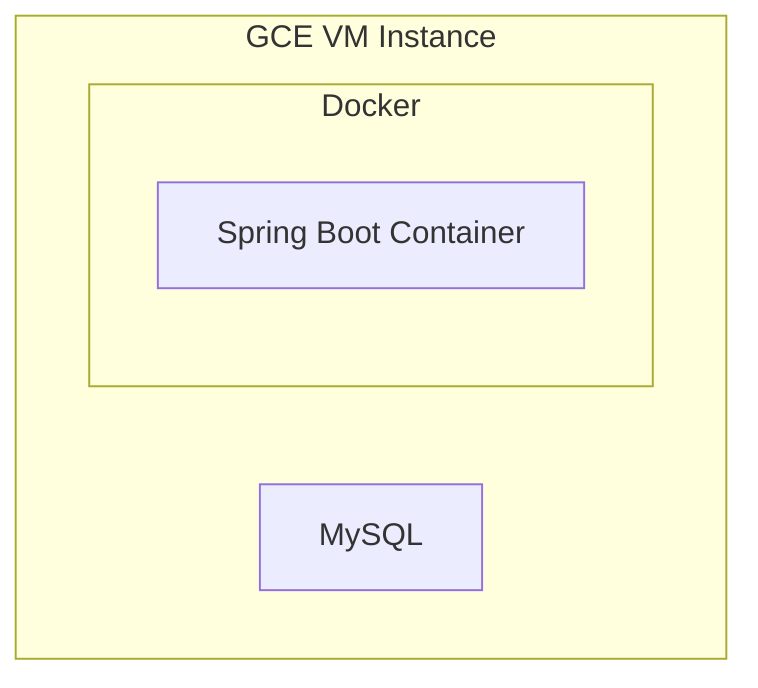

# 쇼핑몰 서비스

이 프로젝트는 Spring Boot를 사용하여 간단한 Rest API 및 웹 페이지를 구현했습니다.

### 기술 스택

* Spring Boot 3
* Java 17
* MySQL 8
* Gradle
* HTML, javascript

### 아키텍처

### ERD

 
 

## 기능

#### 사용자 인증
로그인과 권한 관리 기능을 사용하기 위해 Spring Security를 사용했어요

#### JWT
웹 브라우저와 모바일에서 동시에 사용할 수 있어요. 추후 클라우드에서 서비스하게 될 것을 생각해서 세션 대신 선택했어요. 
refreshToken은 데이터베이스에 저장하고 관리해요

[//]: # (#### 헬스체크 &#40;Spring Actuator 사용&#41;)

[//]: # (1시간마다 정기적으로 확인해서 문제가 생기면 메시지를 전송해요)

#### Validation
컨트롤러에서 전송받는 값의 오류를 줄여 서버의 리소스를 낭비하지 않기 위해 Spring Validation을 사용했어요

 
 

## 트러블 슈팅
### 주문 조회 시 OrderItem 데이터 누락 문제

문제 상황: 주문을 조회하면 해당 주문에 포함된 상품 목록(OrderItem)이 비어 있는 상태였어요
1. 디버깅
* 주문(Order)은 정상 생성되었으나 주문 리스트(OrderItem)는 null로 표시되고 있었어요
* 데이터베이스를 확인한 결과 OrderItem 테이블의 Order FK 가 null로 저장되고 있었어요
2. 문제분석
* 처음에는 조회(get)의 문제라고 생각했지만 저장(save) 과정에서 발생한 문제임을 확인했어요
* FK에 null이 저장되지 않도록 엔티티에 제약 조건을 추가해 save 문제임을 알 수 있도록 수정했어요
* 이 후 문제의 근본 원인을 분석한 결과, 양방향 연관 관계 매핑 시 영속성 컨텍스트가 자동으로 연관 관계에 있는 데이터를 저장해 줄 것이라는 잘못된 가정이 원인이었어요
* 두 객체 간의 관계를 명시적으로 처리하지 않았기 때문에 데이터 누락 문제가 발생했어요
3. 해결방안
* Order 엔티티에 양방향 연관관계 설정 메서드(addOrderItem())를 추가했어요
4. 결과 및 학습
* 문제를 해결하는 과정에서 양방향 연관 관계가 꼭 필요한지 다시 검토하게 되었어요
* 양방향 매핑의 주의점을 공부하며 설계는 단순하게 해야 할 필요를 느끼게 됐어요
 

### jdbc url 연결 실패 문제
문제 상황: MySQL서버는 GCE의 VM 인스턴스에서 실행중이었고 로컬과의 연결은 정상이었지만 다른 클라우드 서비스에서 실행시킨 스프링 컨테이너에서는 MySQL에 연결하지 못 하던 문제가 있었어요
1. 문제분석
* 해당 업체의 콘솔을 통한 터미널 사용에 제약이 많았어요 IP주소에 관한 문제가 의심됐지만 확인이 불가하고, 고정 IP도 받을 수 없는 상황이었어요
2. 해결방안
* 터미널을 자유롭게 사용할 수 있는 VM 인스턴스에 Docker를 설치해 컨테이너를 실행하기로 했어요
* 에러 로그를 확인하여 IP 주소가 MySQL 사용자로 등록되지 않아 발생하는 문제임을 확인했어요
3. 해결방안
* MySQL 서버에 스프링 컨테이너의 IP로 접근할 수 있는 새로운 user를 만들었어요
4. 결과 및 학습
* 디버깅이 어렵거나 사용자가 적은 플랫폼이면 문제 해결도 어렵다는 것을 알게 됐어요
* MySQL은 사용자와 함께 접속 IP도 고려하여 접속을 제한한다는 것을 알게 됐어요. MySQL 8.0부터는 bind-address를 여러 개로 설정할 수 있지만 mysql.user 테이블로 사용자를 관리하는 것이 더 일반적인 방법임을 알게 됐어요

 

## 웹 페이지
http://34.47.120.236:8080/

상품검색, 회원가입, 로그인, 로그아웃 가능

 

## API 명세
http://relaxed-daveta-kiraz-787c046b.koyeb.app/swagger-ui/index.html

## API 시연 이미지
### 권한이 없는 api 접근 시

### 주문 성공

 

## 개선 사항
* 장바구니 페이지
* 주문 페이지
* 가격
* 배송
* DB 백업
* 소셜 로그인
* 결제
* 도메인 구입
* 프론트엔드
