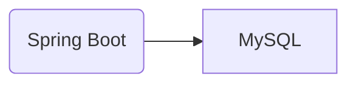

# 쇼핑몰 서비스

## 프로젝트 개요

이 프로젝트는 Spring Boot를 사용하여 간단한 Rest API 를 구현했습니다. 사용자는 상품을 검색하고 주문할 수 있고 관리자는 상품과 주문을 관리할 수 있습니다.

### 기술 스택

* Spring Boot 3
* Java 17
* MySQL
* Gradle

### 아키텍처

### 시나리오

* 쇼핑몰을 방문하면 제품을 볼 수 있어요
* 주문하려면 회원가입을 해야 해요
* 여러 상품을 같이 주문할 수 있어요. 하나의 주문(Order)에 들어간 각 제품들은 OrderItem으로 구분해요
* 재고가 없으면 주문할 수 없어요

 
 

## 기능

#### 사용자 인증 (Spring Security 사용)
로그인, 권한 관리 기능을 제공해요

#### JWT
웹 브라우저와 모바일에서 동시에 사용할 수 있어요. 추후 클라우드에서 서비스하게 될 것을 생각해서 세션 대신 선택했어요. 
access 토큰은 1시간, refresh 토큰은 24시간 유효해요

#### 헬스체크 (Spring Actuator 사용)
1시간마다 정기적으로 확인해서 문제가 생기면 메시지를 전송해요

#### Validation (Spring Validation 사용)
전송받는 값의 오류를 줄여 리소스를 낭비하지 않기 위해 사용했어요

  
 
 

## API 명세
https://localhost:8080/swagger-ui/index.html

## 테스트 방법
(image)

## 트러블 슈팅
* 주문을 조회하면 해당 주문건에 포함된 상품들이 빈 리스트로 나타나던 문제
1. 디버깅하여 주문은 생성되나 주문 리스트는 비어 있는 것을 확인
2. DB에는 저장이 어떻게 되고 있나 봤더니 OrderItem 테이블의 Order FK 가 null로 저장되고 있었음. get의 문제인 줄 알았는데 save의 문제라고 알게 되서 null을 저장하지 못 하도록 수정함
3. null로 저장되고 있는 원인을 살펴보니 결국은 양방향 관계 매핑을 해 두면 영속성 컨텍스트가 자동으로 저장을 해 줄 것이라고 잘못 생각했던 것이 문제였음. 두 객체 모두에게 명시적으로 반영해야 함을 알게되어 Order 엔티티에 양방향 연관관계 설정 메서드를 추가하여 해결함
4. 결과: 양방향이 꼭 필요한가에 대한 검토를 다시 하게 됐고 양방향 관계에서의 주의점 등을 공부하게 됐음

## 개선 사항
* DB 백업
* 상품 설명 text -> image
* 배송 로직
* 소셜 로그인 기능
* 결제 기능
* 도메인 구입
* 프론트 페이지
