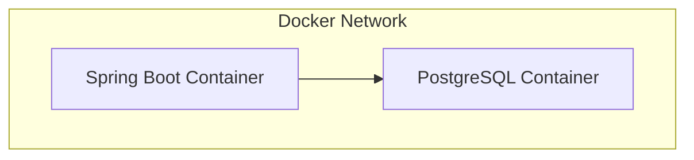

# 쇼핑몰 api 서비스

이 프로젝트는 Spring Boot를 사용하여 간단한 Rest API 를 구현했습니다. 사용자는 상품을 검색하고 주문할 수 있고 관리자는 상품과 주문을 관리할 수 있습니다.

### 기술 스택

* Spring Boot 3
* Java 17
* PostgreSQL
* Gradle

### 아키텍처

### 시나리오

* 방문객도 제품을 볼 수 있어요
* 주문하려면 회원가입이 필요해요
* 여러 상품을 같이 주문할 수 있어요. 하나의 주문(Order)에 들어간 각 제품은 OrderItem으로 구분해요
* 재고가 없으면 주문할 수 없어요

### ERD

 
 

## 기능

#### 사용자 인증
로그인과 권한 관리 기능을 사용하기 위해 Spring Security를 사용했어요

#### JWT
웹 브라우저와 모바일에서 동시에 사용할 수 있어요. 추후 클라우드에서 서비스하게 될 것을 생각해서 세션 대신 선택했어요. 
access 토큰은 1시간, refresh 토큰은 24시간 유효하고 refreshToken은 DB로 관리해요

[//]: # (#### 헬스체크 &#40;Spring Actuator 사용&#41;)

[//]: # (1시간마다 정기적으로 확인해서 문제가 생기면 메시지를 전송해요)

#### Validation
컨트롤러에 전송받는 값의 오류를 줄여 서버의 리소스를 낭비하지 않기 위해 Spring Validation을 사용했어요

 
 

## 트러블 슈팅
* 주문 조회 시 OrderItem 데이터 누락 문제

문제 상황: 주문을 조회하면 해당 주문에 포함된 상품 목록(OrderItem)이 비어 있는 상태였어요
1. 디버깅
* 주문(Order)은 정상 생성되었으나 주문 리스트(OrderItem)는 null로 표시되고 있었어요
* 데이터베이스를 확인한 결과 OrderItem 테이블의 Order FK 가 null로 저장되고 있었어요
2. 문제분석
* 처음에는 조회(get)의 문제라고 생각했지만 저장(save) 과정에서 발생한 문제임을 확인했어요
* FK에 null이 저장되지 않도록 엔티티에 제약 조건을 추가해 save 문제임을 알 수 있도록 수정했어요
* 이 후 문제의 근본 원인을 분석한 결과, 양방향 연관 관계 매핑 시 영속성 컨텍스트가 자동으로 연관 관계에 있는 데이터를 저장해 줄 것이라는 잘못된 가정이 원인이었어요
* 두 객체 간의 관계를 명시적으로 처리하지 않았기 때문에 데이터 누락 문제가 발생했어요
3. 해결방안
* Order 엔티티에 양방향 연관관계 설정 메서드(addOrderItem())를 추가했어요
4. 결과 및 학습
* 문제를 해결하는 과정에서 양방향 연관 관계가 꼭 필요한지 다시 검토하게 되었어요
* 양방향 매핑의 주의점을 공부하며 설계는 단순하게 해야 할 필요를 느끼게 됐어요

 

## API 명세
http://relaxed-daveta-kiraz-787c046b.koyeb.app/swagger-ui/index.html

## 시연 이미지
### 멤버로 로그인 후 권한이 없는 상품 등록 api에 접근했을 때

### 주문을 했을 때

 

## 개선 사항
* 가격 설정
* 배송 로직
* DB 백업
* 상품 설명 text -> image
* 소셜 로그인 기능
* 결제 기능
* 도메인 구입
* 프론트엔드 서버
